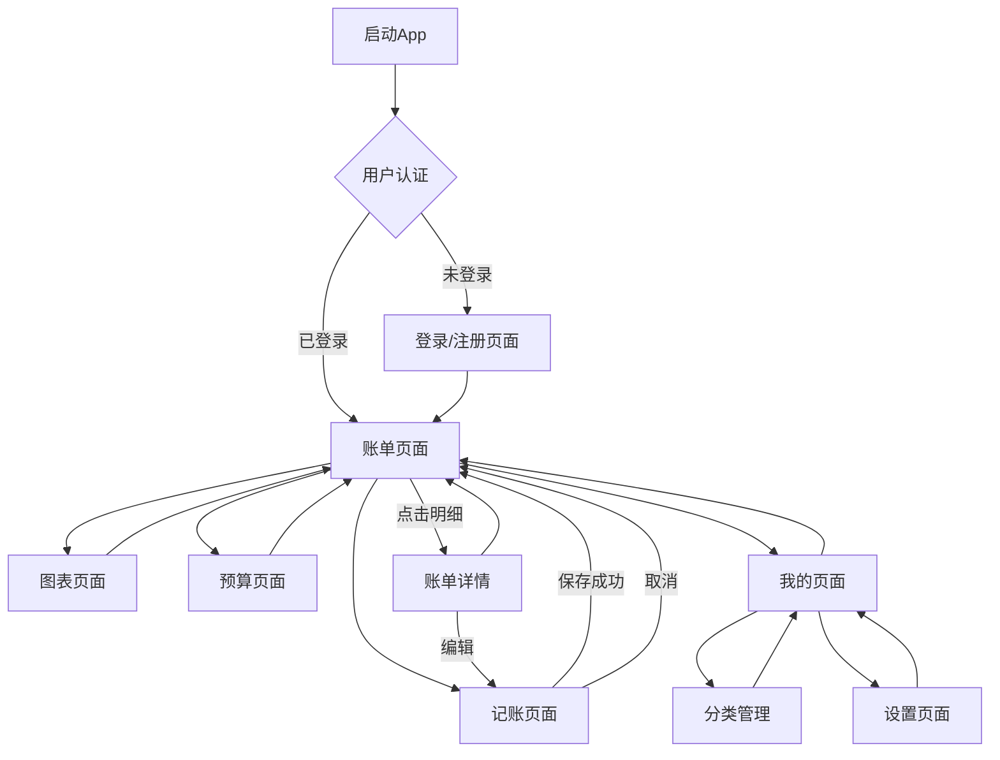

# 📘 极简记账 App 产品需求文档（PRD）

版本号：V1.0  
产品阶段：MVP  
目标平台：iOS（首发）  
商业模式：买断制 + 后期广告  
技术架构：前后端分离  
核心结构：5-Tab导航（账单、图表、记账、预算、我的）  

---

# 一、产品概述

## 1.1 产品背景

当前市场主流记账应用（如 鲨鱼记账、随手记）功能复杂，会员功能较多，对轻度用户不友好。

本产品目标打造：

> 一款极简、温馨、无复杂会员体系的记账 App。

核心理念：

- 3 秒完成记账
- 一眼看清本月花销
- 无复杂理财功能
- 不强制会员

---

## 1.2 产品目标

### 阶段一（MVP）

- 实现基础记账闭环
- 完成 iOS 上架
- 验证用户留存

### 阶段二

- 家庭共享功能
- 预算管理
- 增强统计能力

---

# 二、目标用户

## 2.1 用户画像

### 1️⃣ 学生用户
- 管理生活费
- 希望界面简单可爱

### 2️⃣ 情侣用户
- 记录共同支出
- 统计花费比例

### 3️⃣ 家庭用户
- 管理日常开销
- 控制预算

---

## 2.2 用户核心痛点

- 记账步骤复杂
- 会员功能限制
- 界面偏工具化
- 无情感温度

---

### 2.1 User Roles

| 角色类型   | 注册方式   | 核心权限           | 功能限制         |
| -------- | -------- | ---------------- | -------------- |
| 普通用户   | 手机号验证码注册 | 完整App功能        | 无限制          |
| 游客用户   | 无需注册   | 仅浏览功能         | 无法记账、无数据同步 |
| 会员用户   | 后续版本支持   | 高级功能（数据导出等） | 需付费解锁       |

---

# 三、核心功能模块

---

## 3. Core Process

### 3.1 用户主要操作流程

**首次使用流程**：
1. 打开App → 手机号注册/登录 → 进入账单首页
2. 查看本月收支总览 → 了解App基本功能
3. 点击底部"记账"Tab → 开始第一笔记账

**日常记账流程**：
1. 点击底部"记账"Tab → 选择收入/支出类型
2. 选择消费分类 → 输入金额 → 添加备注（可选）
3. 点击保存 → 自动返回账单页面查看更新

**数据分析流程**：
1. 点击"图表"Tab → 查看趋势走势图
2. 切换年/月/周视图 → 了解消费模式
3. 查看消费占比饼图 → 识别主要支出类别

**预算管理流程**：
1. 点击"预算"Tab → 查看各分类预算使用情况
2. 设置/调整分类预算额度 → 监控使用进度
3. 超预算时收到红色警告提醒

**个人管理流程**：
1. 点击"我的"Tab → 查看记账统计数据
2. 管理个人分类 → 自定义记账类别
3. 设置数据备份 → 保障数据安全

### 3.2 页面导航流程图

## 3.1 5-Tab导航结构

### 1️⃣ 账单页面（首页）

**收支总览区域**
- 显示本月总支出（红色突出）、总收入（绿色）、总结余
- 支持年月选择，点击弹出日期选择器
- 大字号金额显示，视觉层次清晰

**每日明细列表**
- 按日期分组展示账单
- 每笔账单显示：分类图标、备注、金额（支出红色/收入绿色）
- 支持下拉刷新和上拉加载更多

### 2️⃣ 图表页面

**趋势走势图**
- 折线图展示收入支出趋势
- 支持年/月/周切换
- 手势缩放，交互流畅

**消费占比分析**
- 饼图展示各类别消费占比
- 不同颜色区分各类别
- 显示百分比和金额

**类别排行榜**
- 按消费金额排序的类别排行
- 直观展示主要消费类别

**总统计信息**
- 显示选中时间范围的总收入和总支出
- 卡片式布局，信息清晰

### 3️⃣ 记账页面

**类型选择**
- 顶部Tab切换收入/支出
- 选中状态明显区分

**分类网格**
- 4列网格布局展示分类图标
- 点击分类有视觉反馈
- 支持分类自定义（在"我的"页面设置）

**快速记账键盘**
- 底部弹起的大键盘设计
- 包含数字键、小数点、删除键
- 支持快速输入和修改

**记账流程优化**
- 打开到保存 ≤ 3秒
- 默认当天日期
- 支持备注输入
- 编辑和删除已记账单

### 4️⃣ 预算页面（V1.0 - P0）

**预算设置**
- 为各消费类别设置月度预算
- 支持自定义预算额度
- 预算修改实时生效

**预算监控**
- 列表显示各分类预算使用情况
- 进度条直观展示使用比例
- 超预算红色警告标识
- 支持预算完成度统计

### 5️⃣ 我的页面

**个人信息区域**
- 头像、昵称、手机号展示
- 支持头像更换和昵称修改

**记账统计数据**
- 累计记账天数
- 记账总笔数
- 打卡天数
- 连续打卡记录

**设置功能**
- 分类管理（新增/删除自定义分类）
- 数据备份与恢复
- 关于我们
- 退出登录

---

# 四、功能优先级

| 功能模块   | 具体功能   | 优先级 | 版本 |
| -------- | -------- | ------ | ---- |
| 用户系统   | 注册登录   | P0     | V1.0 |
|          | 忘记密码   | P0     | V1.0 |
| 记账功能   | 快速记账   | P0     | V1.0 |
|          | 编辑删除   | P0     | V1.0 |
| 账单页面   | 收支总览   | P0     | V1.0 |
|          | 明细列表   | P0     | V1.0 |
| 图表页面   | 趋势分析   | P1     | V1.0 |
|          | 占比分析   | P1     | V1.0 |
| 预算管理   | 预算设置   | P0     | V1.0 |
|          | 预算监控   | P0     | V1.0 |
| 分类管理   | 自定义分类  | P0     | V1.0 |
| 家庭共享   | 多人记账   | P2     | V1.1 |
| 广告系统   | 广告展示   | P3     | V1.2 |
| 数据导出   | CSV导出   | P3     | V2.0 |

说明：
- P0 = 必须
- P1 = 重要
- P2 = 可延后
- P3 = 优化项

---

# 五、界面设计要求

## 5.1 视觉风格

- 温馨可爱
- 极简设计
- 主色：奶白 + 柔粉 / 柔蓝
- 圆角卡片
- 大字号金额
- 扁平化图标

---

## 5.2 首页布局

顶部：
- 本月收支卡片
- 结余突出显示

中部：
- 最近账单列表

右下角：
- 悬浮 “+” 快速记账按钮

---

## 5.3 记账页面

元素：

- 大数字金额输入区
- 收入/支出切换
- 分类网格图标
- 日期选择器
- 备注输入框
- 保存按钮突出

---

## 5.4 图表页面

顶部：
- 年/月/周切换按钮

中部：
- 收入/支出趋势折线图
- 消费占比饼图
- 消费类别排行榜

底部：
- 总收入/总支出统计卡片

---

## 5.5 预算页面（V1.0核心功能）

- 分类预算列表
- 预算额度设置
- 预算使用情况进度条
- 超预算红色警告标识
- 预算完成度统计

## 5.6 我的页面

个人信息区域：
- 头像、昵称、手机号

统计数据：
- 累计记账天数
- 记账总笔数
- 打卡天数
- 连续打卡记录

---

# 六、技术架构

## 6.1 前端技术栈

- **框架**：Vue3 + JavaScript
- **跨平台**：UniApp（支持iOS/Android/小程序）
- **状态管理**：Pinia
- **图表库**：ECharts
- **UI组件**：UniUI + 自定义组件
- **构建工具**：Vite

## 6.2 后端技术栈

- **框架**：Spring Boot 2.7+
- **数据库**：MySQL 8.0
- **ORM框架**：MyBatis-Plus
- **缓存**：Redis（验证码 + Token缓存）
- **认证**：JWT登录认证
- **接口文档**：Swagger/OpenAPI
- **部署**：Docker + Nginx

---

## 部署建议

- 云服务器（阿里云 / 腾讯云）
- Nginx
- HTTPS 证书
- 定期数据库备份

---

# 七、非功能性需求

## 7.1 性能指标

- 页面加载时间 ≤ 2秒
- 接口响应时间 ≤ 500ms
- 记账操作响应 ≤ 300ms
- 支持1000+并发用户
- 图表渲染流畅无卡顿

## 7.2 安全要求

- 密码BCrypt加密存储
- JWT鉴权机制
- HTTPS加密通信
- 防SQL注入攻击
- 验证码发送频率限制
- 敏感数据加密存储

## 7.3 稳定性要求

- 接口统一返回结构
- 异常统一处理机制
- 关键操作日志记录
- 数据库事务控制
- 每日自动数据备份
- 支持离线记账，网络恢复后同步

## 7.4 数据一致性

- 账单保存必须事务控制
- 删除操作采用逻辑删除
- 支持数据备份和恢复
- 多设备同步数据一致性（后续版本）

---

## 7.1 性能

- 页面加载 ≤ 2 秒
- 接口响应 ≤ 500ms
- 支持 1000+ 并发用户

---

## 7.2 安全

- 密码 BCrypt 加密
- JWT 鉴权
- HTTPS 加密通信
- 防 SQL 注入
- 限制验证码发送频率

---

## 7.3 稳定性

- 接口统一返回结构
- 异常统一处理
- 关键操作日志记录
- 数据库每日备份

---

## 7.4 数据一致性

- 账单保存必须事务控制
- 删除可采用逻辑删除

---

# 八、版本规划与里程碑

## V1.0（MVP）- 当前版本

**核心目标**：实现基础记账闭环，验证用户留存

**主要功能**：
- ✅ 用户注册登录系统
- ✅ 5-Tab导航架构
- ✅ 快速记账功能（≤3秒）
- ✅ 账单收支总览
- ✅ 基础图表分析
- ✅ 预算管理功能（P0优先级）
- ✅ 分类管理系统

## V1.1 - 社交功能

**预计发布**：上线后2个月

**新增功能**：
- 家庭共享记账
- 多人协作功能
- 记账提醒推送

## V1.2 - 商业化

**预计发布**：上线后4个月

**新增功能**：
- 广告系统接入
- 高级统计功能
- 数据导出功能

## V2.0 - 功能完善

**预计发布**：上线后6个月

**新增功能**：
- 年度报告生成
- 主题皮肤系统
- 多平台数据同步
- 智能记账建议

---

# 九、关键成功指标（KPI）

## 9.1 用户活跃度

- 日活跃用户记账次数 ≥ 1次
- 次日留存率 ≥ 40%
- 7日留存率 ≥ 20%
- 月活跃用户占比 ≥ 60%

## 9.2 用户满意度

- App Store评分 ≥ 4.5星
- 真实用户反馈 ≥ 50条
- 用户推荐意愿（NPS）≥ 50

## 9.3 产品性能

- 页面崩溃率 ≤ 0.1%
- 用户投诉处理率 ≥ 95%
- 功能使用完成率 ≥ 80%

## 9.4 商业指标

- V1.2版本广告点击率 ≥ 2%
- 付费转化率 ≥ 5%（后续付费功能）
- 用户获取成本（CAC）≤ ￥10

---

# 十、产品核心原则

1. 简单优先于复杂  
2. UI 优先于功能堆积  
3. 所有功能围绕“快速记账”  
4. 不做复杂理财系统  
5. 不强制会员锁功能  

---

# 结语

本 PRD 为 MVP 阶段执行文档。

目标不是功能全面，而是验证：

> 是否有人愿意每天打开它记账。