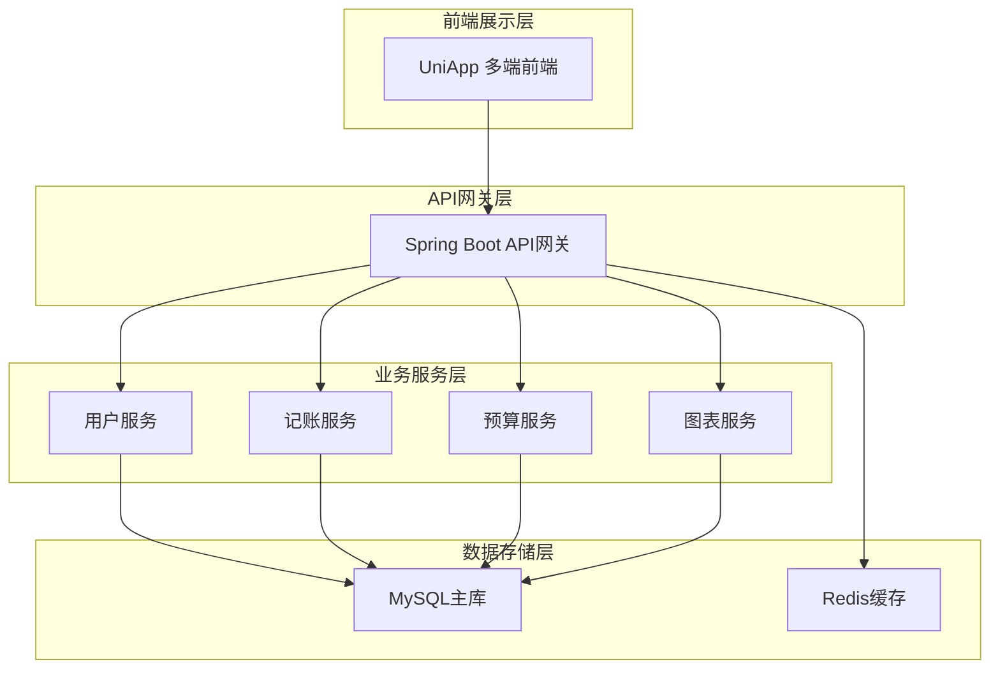

# 技术设计文档 (Technical Design Document)

## 1. 架构设计 (Architecture Design)

### 1.1 整体架构
基于PRD文档的5-Tab导航结构（账单、图表、记账、预算、我的），采用前后端分离架构：



### 1.2 5-Tab架构映射
- **账单Tab**：交易记录查询服务 + 缓存优化
- **图表Tab**：数据统计服务 + 图表计算引擎
- **记账Tab**：交易录入服务 + 实时数据同步
- **预算Tab**：预算管理服务 + 预警机制
- **我的Tab**：用户管理服务 + 个人数据中心

## 2. 技术栈选择 (Tech Stack Selection)

严格采用 UniApp + Spring Boot + MySQL 技术栈，确保多端兼容性和企业级后端能力。

### 前端 (Frontend)

* **核心框架**: UniApp (基于 Vue 3) - 支持微信小程序、App、H5 多端发布

* **开发工具**: HBuilderX / CLI 模式

* **状态管理**: Pinia (轻量级，Vue 官方推荐)

* **路由管理**: UniApp 原生路由

* **图表库**: uCharts (专为 UniApp 优化的图表库)

* **图标库**: 阿里字体图标 / 本地图标

* **本地存储**: UniApp Storage API (支持离线功能)

### 后端 (Backend) & 数据库 (Database)

* **后端框架**: Spring Boot 2.7.x

* **数据访问**: MyBatis-Plus 3.5.x (基于 MyBatis 封装，提供 CRUD 操作)

* **数据库**: MySQL 8.0+ (用户指定)

* **缓存**: Redis 6.x (缓存热点数据)

* **安全框架**: Spring Security + JWT

* **接口文档**: Swagger / Knife4j

* **理由**:

  * UniApp 提供优秀的跨平台能力，一套代码多端运行
  * Spring Boot 提供稳定可靠的企业级后端服务
  * MySQL 8.0 提供强大的关系型数据库支持
  * Redis 缓存提升系统性能

## 3. 项目结构 (Project Structure)

### UniApp 前端项目结构（5-Tab架构）

基于PRD文档的5-Tab导航结构，优化页面组织和组件复用：

```
easy-accounting-uniapp/
├── pages/                           # 业务页面目录（按5-Tab组织）
│   ├── tab-bar/                     # TabBar页面（5个主Tab）
│   │   ├── bill/                    # 账单Tab（首页）
│   │   │   ├── index.vue            # 账单首页（收支总览+明细列表）
│   │   │   └── detail.vue           # 账单详情页
│   │   ├── chart/                   # 图表Tab
│   │   │   ├── index.vue            # 图表首页（趋势图+饼图+排行）
│   │   │   └── trend.vue            # 趋势详情页
│   │   ├── bookkeeping/             # 记账Tab
│   │   │   ├── index.vue            # 记账页面（类型选择+分类网格+键盘）
│   │   │   └── edit.vue             # 编辑账单页
│   │   ├── budget/                  # 预算Tab
│   │   │   ├── index.vue            # 预算首页（预算列表+使用情况）
│   │   │   └── setting.vue          # 预算设置页
│   │   └── me/                      # 我的Tab
│   │       ├── index.vue            # 个人中心（信息+统计+设置入口）
│   │       ├── category.vue         # 分类管理页
│   │       ├── settings.vue         # 设置页面
│   │       └── profile.vue          # 个人信息编辑页
│   ├── auth/                        # 认证相关页面
│   │   ├── login.vue                # 手机号登录页
│   │   └── sms-verify.vue           # 短信验证码页
│   └── common/                      # 通用页面
│       └── webview.vue              # 通用WebView页面
├── components/                      # 公共组件（按功能模块组织）
│   ├── bill/                        # 账单相关组件
│   │   ├── bill-summary.vue         # 收支总览卡片
│   │   ├── bill-list.vue            # 账单列表组件
│   │   └── bill-item.vue            # 账单列表项
│   ├── chart/                       # 图表相关组件
│   │   ├── trend-chart.vue          # 趋势图组件
│   │   ├── pie-chart.vue            # 饼图组件
│   │   └── ranking-list.vue         # 排行榜组件
│   ├── bookkeeping/                 # 记账相关组件
│   │   ├── type-switch.vue          # 收入支出切换
│   │   ├── category-grid.vue        # 分类网格
│   │   ├── number-keyboard.vue       # 数字键盘
│   │   └── quick-note.vue           # 快速备注
│   ├── budget/                      # 预算相关组件
│   │   ├── budget-progress.vue      # 预算进度条
│   │   ├── budget-warning.vue       # 预算预警提示
│   │   └── budget-setting.vue       # 预算设置表单
│   ├── common/                      # 通用组件
│   │   ├── tab-bar.vue              # 自定义TabBar
│   │   ├── date-picker.vue          # 日期选择器
│   │   ├── loading-more.vue         # 加载更多
│   │   └── empty-state.vue          # 空状态提示
│   └── layout/                      # 布局组件
│       ├── page-header.vue          # 页面头部
│       └── page-container.vue       # 页面容器
├── composables/                     # 组合式函数（Vue3）
│   ├── useAuth.js                   # 认证相关逻辑
│   ├── useTransactions.js           # 交易记录逻辑
│   ├── useCategories.js             # 分类管理逻辑
│   ├── useBudget.js                 # 预算管理逻辑
│   ├── useCharts.js                 # 图表数据逻辑
│   └── useSync.js                   # 数据同步逻辑
├── utils/                           # 工具函数（按功能分类）
│   ├── api/                         # API相关
│   │   ├── request.js               # 请求拦截器
│   │   ├── auth.js                # 认证API
│   │   ├── transaction.js           # 交易API
│   │   ├── chart.js               # 图表API
│   │   └── budget.js              # 预算API
│   ├── constants/                   # 常量定义
│   │   ├── categories.js            # 系统分类常量
│   │   ├── colors.js                # 颜色常量
│   │   └── config.js                # 全局配置
│   ├── helpers/                     # 辅助函数
│   │   ├── date.js                  # 日期处理
│   │   ├── number.js                # 数字格式化
│   │   ├── storage.js               # 本地存储
│   │   └── validator.js             # 表单验证
│   └── platform/                    # 平台相关
│       ├── index.js                 # 平台判断
│       └── adapter.js               # 平台适配器
├── store/                           # Pinia状态管理（按模块组织）
│   ├── modules/
│   │   ├── user.js                  # 用户状态（登录信息、个人资料）
│   │   ├── transactions.js          # 交易记录状态
│   │   ├── categories.js            # 分类状态（系统+自定义）
│   │   ├── budget.js                # 预算状态（设置+使用情况）
│   │   ├── charts.js                # 图表数据状态
│   │   ├── sync.js                  # 同步状态（离线+同步中）
│   │   └── ui.js                    # UI状态（加载+错误+提示）
│   ├── index.js                     # Store入口
│   └── persist.js                   # 状态持久化配置
├── static/                          # 静态资源（按类型组织）
│   ├── images/                      # 图片资源
│   │   ├── categories/              # 分类图标
│   │   ├── charts/                  # 图表相关图片
│   │   └── common/                  # 通用图片
│   ├── icons/                       # 图标字体
│   │   ├── custom-icons.css         # 自定义图标字体
│   │   └── iconfont.css             # 阿里图标字体
│   └── mock/                        # 模拟数据
│       ├── transactions.json         # 交易数据
│       └── categories.json           # 分类数据
├── styles/                          # 样式文件
│   ├── variables.scss               # SCSS变量（主题色、字体等）
│   ├── mixins.scss                  # SCSS混合
│   ├── common.scss                  # 通用样式
│   └── theme/                       # 主题样式
│       ├── default.scss             # 默认主题（温馨可爱）
│       └── dark.scss                # 暗色主题（预留）
├── App.vue                          # 应用入口组件
├── main.js                          # 应用入口文件
├── manifest.json                    # 应用配置（AppID、权限等）
├── pages.json                       # 页面路由+TabBar配置
└── uni.scss                         # 全局样式（UniApp约定）
```

### Spring Boot 后端项目结构

采用标准的 Maven 项目结构，遵循 Spring Boot 最佳实践，并结合分层架构思想进行优化，确保代码的可维护性和扩展性。

```
easy-accounting/
├── src/
│   ├── main/
│   │   ├── java/com/example/accounting/
│   │   │   ├── common/              # 通用模块
│   │   │   │   ├── result/          # 统一响应结果 (Result, PageResult)
│   │   │   │   ├── exception/       # 全局异常处理 (GlobalExceptionHandler)
│   │   │   │   ├── constant/        # 常量定义 (SystemConstant, RedisKey)
│   │   │   │   └── util/            # 通用工具类 (JwtUtil, DateUtil)
│   │   │   ├── config/              # 配置类
│   │   │   │   ├── SecurityConfig.java   # Spring Security配置
│   │   │   │   ├── SwaggerConfig.java    # 接口文档配置 (Knife4j)
│   │   │   │   ├── MyBatisPlusConfig.java # 分页插件配置
│   │   │   │   ├── RedisConfig.java      # 缓存配置
│   │   │   │   └── WebMvcConfig.java     # 跨域与拦截器配置
│   │   │   ├── controller/          # 控制器层 (Web API)
│   │   │   │   ├── AuthController.java       # 认证相关
│   │   │   │   ├── UserController.java       # 用户管理
│   │   │   │   ├── TransactionController.java # 交易记录 (对应"账单"、"记账")
│   │   │   │   ├── CategoryController.java   # 分类管理
│   │   │   │   ├── BudgetController.java     # 预算管理
│   │   │   │   └── ChartController.java      # 图表分析
│   │   │   ├── service/             # 服务接口层
│   │   │   │   ├── UserService.java
│   │   │   │   ├── TransactionService.java
│   │   │   │   ├── CategoryService.java
│   │   │   │   ├── BudgetService.java
│   │   │   │   └── ChartService.java
│   │   │   ├── service/impl/        # 服务实现层
│   │   │   │   ├── UserServiceImpl.java
│   │   │   │   ├── TransactionServiceImpl.java
│   │   │   │   ├── CategoryServiceImpl.java
│   │   │   │   ├── BudgetServiceImpl.java
│   │   │   │   └── ChartServiceImpl.java
│   │   │   ├── mapper/              # Mapper接口层 (DAO)
│   │   │   │   ├── UserMapper.java
│   │   │   │   ├── TransactionMapper.java
│   │   │   │   ├── CategoryMapper.java
│   │   │   │   ├── BudgetMapper.java
│   │   │   │   └── UserStatsMapper.java
│   │   │   ├── entity/              # 数据库实体类 (PO)
│   │   │   │   ├── User.java
│   │   │   │   ├── Transaction.java
│   │   │   │   ├── Category.java
│   │   │   │   ├── CategoryBudget.java
│   │   │   │   └── UserStats.java
│   │   │   └── model/               # 数据模型
│   │   │       ├── dto/             # 数据传输对象 (Input)
│   │   │       └── vo/              # 视图对象 (Output)
│   │   └── resources/
│   │       ├── mapper/              # Mapper XML文件
│   │       │   ├── UserMapper.xml
│   │       │   ├── TransactionMapper.xml
│   │       │   ├── CategoryMapper.xml
│   │       │   ├── BudgetMapper.xml
│   │       │   └── UserStatsMapper.xml
│   │       ├── application.yml      # 主配置文件
│   │       ├── application-dev.yml  # 开发环境配置
│   │       ├── application-prod.yml # 生产环境配置
│   │       └── logback-spring.xml   # 日志配置
│   └── test/                        # 测试代码
├── pom.xml                          # Maven依赖管理
└── README.md
```

## 4. 数据模型 (Data Model)

基于MySQL关系型数据库设计，采用Spring Boot JPA实体映射。

### 6.1 用户表 (users)
存储用户基础信息和认证信息，支持手机号验证码注册。

```sql
CREATE TABLE `users` (
  `id` bigint NOT NULL AUTO_INCREMENT COMMENT '用户ID',
  `phone` varchar(20) NOT NULL COMMENT '手机号（主登录方式）',
  `password` varchar(255) DEFAULT NULL COMMENT '密码(BCrypt加密，可选)',
  `nickname` varchar(50) DEFAULT NULL COMMENT '昵称',
  `avatar_url` varchar(255) DEFAULT NULL COMMENT '头像URL',
  `status` tinyint DEFAULT 1 COMMENT '状态(1-正常，0-禁用)',
  `register_type` varchar(20) DEFAULT 'phone' COMMENT '注册方式(phone-手机, guest-游客)',
  `created_at` datetime DEFAULT CURRENT_TIMESTAMP COMMENT '创建时间',
  `updated_at` datetime DEFAULT CURRENT_TIMESTAMP ON UPDATE CURRENT_TIMESTAMP COMMENT '更新时间',
  PRIMARY KEY (`id`),
  UNIQUE KEY `uk_phone` (`phone`),
  KEY `idx_status` (`status`)
) ENGINE=InnoDB DEFAULT CHARSET=utf8mb4 COMMENT='用户表';
```

### 6.2 账单分类表 (categories)
支持系统预置分类和用户自定义分类，按类型区分收入和支出。

```sql
CREATE TABLE `categories` (
  `id` bigint NOT NULL AUTO_INCREMENT COMMENT '分类ID',
  `user_id` bigint DEFAULT NULL COMMENT '所属用户ID(NULL表示系统预置)',
  `name` varchar(50) NOT NULL COMMENT '分类名称',
  `type` varchar(10) NOT NULL COMMENT '类型(expense-支出，income-收入)',
  `icon` varchar(50) DEFAULT NULL COMMENT '图标标识',
  `color` varchar(7) DEFAULT NULL COMMENT '颜色值(十六进制)',
  `sort_order` int DEFAULT 0 COMMENT '排序权重',
  `is_system` tinyint DEFAULT 0 COMMENT '是否系统预置(1-是，0-否)',
  `created_at` datetime DEFAULT CURRENT_TIMESTAMP COMMENT '创建时间',
  `updated_at` datetime DEFAULT CURRENT_TIMESTAMP ON UPDATE CURRENT_TIMESTAMP COMMENT '更新时间',
  PRIMARY KEY (`id`),
  KEY `idx_user_id` (`user_id`),
  KEY `idx_type` (`type`),
  KEY `idx_system` (`is_system`)
) ENGINE=InnoDB DEFAULT CHARSET=utf8mb4 COMMENT='账单分类表';

-- 系统预置分类数据
INSERT INTO `categories` (name, type, icon, color, is_system, sort_order) VALUES
('餐饮', 'expense', 'food', '#FF6B6B', 1, 1),
('交通', 'expense', 'transport', '#4ECDC4', 1, 2),
('购物', 'expense', 'shopping', '#45B7D1', 1, 3),
('娱乐', 'expense', 'entertainment', '#96CEB4', 1, 4),
('工资', 'income', 'salary', '#51CF66', 1, 1),
('兼职', 'income', 'parttime', '#FFD93D', 1, 2);
```

### 6.3 账单记录表 (transactions)
支持快速记账流程，优化索引提升查询性能。

```sql
CREATE TABLE `transactions` (
  `id` bigint NOT NULL AUTO_INCREMENT COMMENT '记录ID',
  `user_id` bigint NOT NULL COMMENT '用户ID',
  `category_id` bigint NOT NULL COMMENT '分类ID',
  `amount` decimal(12,2) NOT NULL COMMENT '金额',
  `type` varchar(10) NOT NULL COMMENT '类型(expense-支出，income-收入)',
  `date` date NOT NULL COMMENT '记账日期',
  `note` varchar(255) DEFAULT NULL COMMENT '备注',
  `sync_status` tinyint DEFAULT 1 COMMENT '同步状态(1-已同步，0-待同步)',
  `created_at` datetime DEFAULT CURRENT_TIMESTAMP COMMENT '创建时间',
  `updated_at` datetime DEFAULT CURRENT_TIMESTAMP ON UPDATE CURRENT_TIMESTAMP COMMENT '更新时间',
  PRIMARY KEY (`id`),
  KEY `idx_user_id` (`user_id`),
  KEY `idx_category_id` (`category_id`),
  KEY `idx_date` (`date`),
  KEY `idx_user_date` (`user_id`, `date`),
  KEY `idx_user_type_date` (`user_id`, `type`, `date`)
) ENGINE=InnoDB DEFAULT CHARSET=utf8mb4 COMMENT='账单记录表';
```

### 6.4 分类预算表 (category_budgets)
支持按消费类别设置月度预算，实现预算监控和预警。

```sql
CREATE TABLE `category_budgets` (
  `id` bigint NOT NULL AUTO_INCREMENT COMMENT '预算ID',
  `user_id` bigint NOT NULL COMMENT '用户ID',
  `category_id` bigint NOT NULL COMMENT '分类ID',
  `month` varchar(7) NOT NULL COMMENT '预算月份(YYYY-MM)',
  `budget_amount` decimal(12,2) NOT NULL COMMENT '预算金额',
  `alert_threshold` decimal(5,2) DEFAULT 0.80 COMMENT '预警阈值(默认80%)',
  `created_at` datetime DEFAULT CURRENT_TIMESTAMP COMMENT '创建时间',
  `updated_at` datetime DEFAULT CURRENT_TIMESTAMP ON UPDATE CURRENT_TIMESTAMP COMMENT '更新时间',
  PRIMARY KEY (`id`),
  UNIQUE KEY `uk_user_category_month` (`user_id`, `category_id`, `month`),
  KEY `idx_user_month` (`user_id`, `month`),
  KEY `idx_category` (`category_id`)
) ENGINE=InnoDB DEFAULT CHARSET=utf8mb4 COMMENT='分类预算表';
```

### 6.5 用户统计表 (user_stats)
缓存用户记账统计数据，提升查询性能。

```sql
CREATE TABLE `user_stats` (
  `id` bigint NOT NULL AUTO_INCREMENT COMMENT '统计ID',
  `user_id` bigint NOT NULL COMMENT '用户ID',
  `total_days` int DEFAULT 0 COMMENT '累计记账天数',
  `total_records` int DEFAULT 0 COMMENT '记账总笔数',
  `continuous_days` int DEFAULT 0 COMMENT '连续打卡天数',
  `last_record_date` date DEFAULT NULL COMMENT '最后记账日期',
  `current_month_expense` decimal(12,2) DEFAULT 0 COMMENT '当月支出',
  `current_month_income` decimal(12,2) DEFAULT 0 COMMENT '当月收入',
  `updated_at` datetime DEFAULT CURRENT_TIMESTAMP ON UPDATE CURRENT_TIMESTAMP COMMENT '更新时间',
  PRIMARY KEY (`id`),
  UNIQUE KEY `uk_user_id` (`user_id`)
) ENGINE=InnoDB DEFAULT CHARSET=utf8mb4 COMMENT='用户统计表';
```

## 4. API设计 (API Design)

### 4.1 认证相关API

#### 手机号验证码登录
```
POST /api/auth/sms-login
```

请求参数：
| 参数名 | 类型 | 必填 | 说明 |
|--------|------|------|------|
| phone | string | 是 | 手机号 |
| smsCode | string | 是 | 短信验证码 |

响应示例：
```json
{
  "code": 200,
  "message": "success",
  "data": {
    "token": "eyJhbGciOiJIUzI1NiIsInR5cCI6IkpXVCJ9...",
    "user": {
      "id": 1,
      "nickname": "用户昵称",
      "avatar": "头像URL"
    }
  }
}
```

#### 发送短信验证码
```
POST /api/auth/send-sms
```

### 4.2 交易记录API

#### 创建交易记录
```
POST /api/transactions
```

请求参数：
| 参数名 | 类型 | 必填 | 说明 |
|--------|------|------|------|
| categoryId | number | 是 | 分类ID |
| amount | number | 是 | 金额 |
| type | string | 是 | 类型(expense/income) |
| date | string | 是 | 日期(YYYY-MM-DD) |
| note | string | 否 | 备注 |

#### 获取月度交易列表
```
GET /api/transactions/monthly
```

查询参数：
| 参数名 | 类型 | 必填 | 说明 |
|--------|------|------|------|
| year | number | 是 | 年份 |
| month | number | 是 | 月份 |
| type | string | 否 | 类型筛选 |

#### 获取交易统计
```
GET /api/transactions/stats
```

### 4.3 图表分析API

#### 获取趋势数据
```
GET /api/charts/trend
```

查询参数：
| 参数名 | 类型 | 必填 | 说明 |
|--------|------|------|------|
| period | string | 是 | 周期(year/month/week) |
| type | string | 是 | 类型(expense/income) |

#### 获取占比数据
```
GET /api/charts/pie
```

#### 获取排行榜数据
```
GET /api/charts/ranking
```

### 4.4 预算管理API

#### 设置分类预算
```
POST /api/budgets/category
```

请求参数：
| 参数名 | 类型 | 必填 | 说明 |
|--------|------|------|------|
| categoryId | number | 是 | 分类ID |
| month | string | 是 | 预算月份(YYYY-MM) |
| amount | number | 是 | 预算金额 |
| alertThreshold | number | 否 | 预警阈值(默认0.8) |

#### 获取预算使用情况
```
GET /api/budgets/status
```

查询参数：
| 参数名 | 类型 | 必填 | 说明 |
|--------|------|------|------|
| month | string | 是 | 查询月份(YYYY-MM) |

#### 获取预算完成度统计
```
GET /api/budgets/completion
```

### 4.5 分类管理API

#### 获取分类列表
```
GET /api/categories
```

查询参数：
| 参数名 | 类型 | 必填 | 说明 |
|--------|------|------|------|
| type | string | 否 | 类型(expense/income) |
| includeSystem | boolean | 否 | 是否包含系统分类 |

#### 添加自定义分类
```
POST /api/categories/custom
```

请求参数：
| 参数名 | 类型 | 必填 | 说明 |
|--------|------|------|------|
| name | string | 是 | 分类名称 |
| type | string | 是 | 类型(expense/income) |
| icon | string | 是 | 图标标识 |
| color | string | 是 | 颜色值 |

## 5. 关键技术点 (Key Technical Points)

### 5.1 UniApp 5-Tab导航实现
-   **TabBar配置**: 在 `pages.json` 中配置5个Tab页面路径和图标
-   **Tab切换优化**: 使用 `uni.switchTab` 实现Tab间切换，保持页面状态
-   **Tab红点提示**: 预算超支时在预算Tab显示红点提醒
-   **Tab自定义样式**: 根据温馨可爱风格自定义TabBar颜色和图标

### 5.2 快速记账优化（3秒完成）
-   **预加载分类**: 进入记账页面前预加载用户分类数据
-   **默认日期**: 自动填充当天日期，减少用户操作
-   **大键盘设计**: 优化数字键盘大小和响应区域
-   **一键保存**: 简化保存流程，减少确认步骤
-   **本地缓存**: 离线记账数据本地存储，网络恢复后自动同步

### 5.3 预算预警机制
-   **实时计算**: 每笔消费后实时计算分类预算使用率
-   **阈值预警**: 达到80%预警阈值时推送提醒
-   **超预算拦截**: 可选择性拦截超预算消费记录
-   **月度重置**: 每月自动重置预算使用情况
-   **Redis缓存**: 缓存预算使用情况，提升查询性能

### 5.4 图表性能优化
-   **数据聚合**: 服务端预聚合统计数据，减少前端计算
-   **分页加载**: 大量数据时分页加载，避免内存溢出
-   **缓存策略**: Redis缓存图表数据，减少数据库查询
-   **懒加载**: 图表组件按需加载，提升页面响应速度
-   **uCharts优化**: 使用uCharts原生渲染，提升图表性能

### 5.5 手机号验证码认证
-   **短信服务**: 集成阿里云/腾讯云短信服务
-   **验证码缓存**: Redis缓存验证码，5分钟有效期
-   **防刷机制**: 限制验证码发送频率，防止恶意调用
-   **Token续期**: JWT Token支持自动续期，避免频繁登录
-   **游客模式**: 支持游客浏览，限制记账功能

### 5.6 多端数据同步
-   **增量同步**: 基于时间戳的增量数据同步机制
-   **冲突解决**: 时间戳 + 用户优先级解决数据冲突
-   **离线支持**: SQLite本地存储，支持离线记账功能
-   **同步状态**: 提供同步状态提示和失败重试机制
-   **网络监听**: 实时监听网络状态变化，自动同步数据

### 5.7 数据一致性保障
-   **事务控制**: 账单保存使用数据库事务，确保数据一致性
-   **逻辑删除**: 采用逻辑删除，保留数据审计轨迹
-   **每日备份**: 自动数据备份，支持数据恢复
-   **主从复制**: MySQL主从配置，确保数据安全
-   **异常处理**: 统一的异常处理和日志记录机制

### 5.8 性能监控指标
-   **接口响应**: 所有API接口响应时间≤500ms
-   **记账操作**: 记账保存操作响应时间≤300ms
-   **页面加载**: 页面加载时间≤2秒
-   **并发支持**: 支持1000+并发用户同时在线
-   **内存优化**: 合理使用内存，避免内存泄漏

### 4.5 多端部署方案
-   **小程序**: 微信开发者工具上传发布
-   **App打包**: HBuilderX 云打包或本地打包
-   **H5部署**: 构建为 H5 静态文件，部署到 Web 服务器
-   **后端部署**: Spring Boot 打包为 jar，使用 Docker 容器化部署
-   **数据库部署**: MySQL 主从配置，确保数据安全

